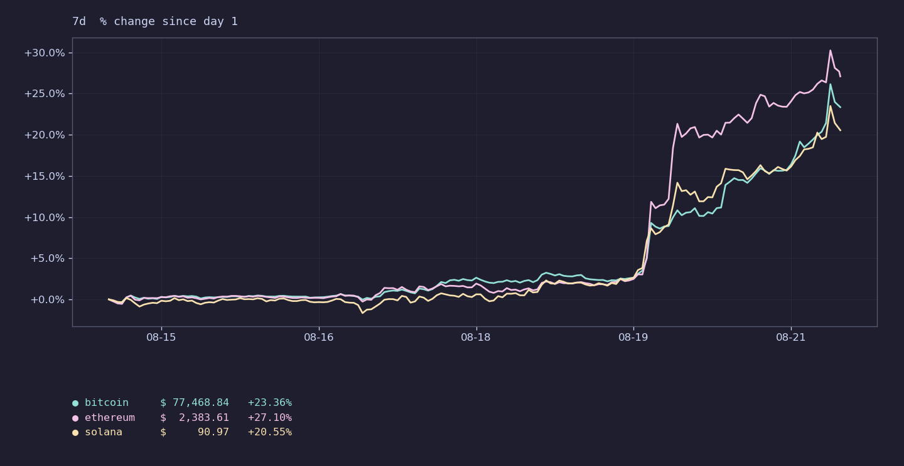
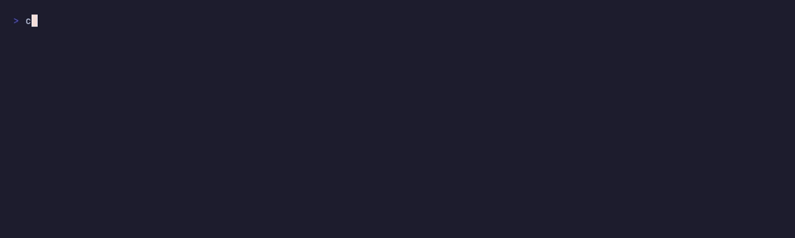
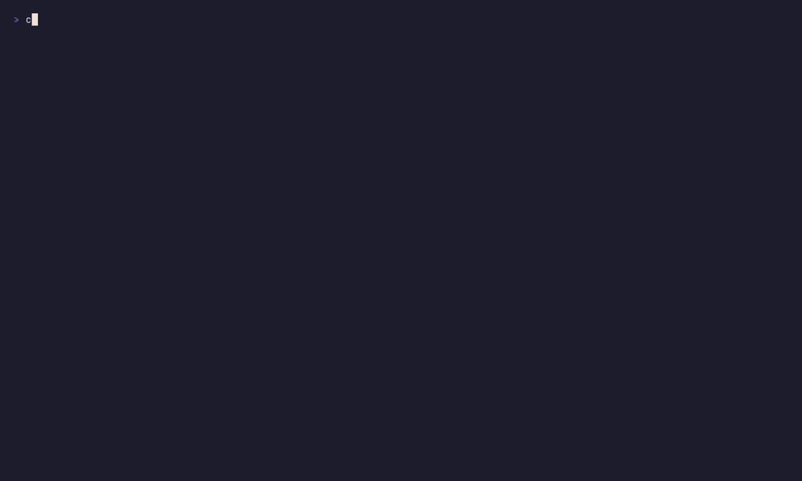

<h1 align="center">coinfetch</h1>

<p align="center">
  <em>Crypto prices and wallet balances in your terminal.</em>
</p>

<p align="center">
  <a href="https://github.com/nvrmnd-png/coinfetch/releases"></a>
  
  
  <a href="https://github.com/nvrmnd-png/coinfetch/commits/master"></a>
  <a href="https://github.com/nvrmnd-png/coinfetch/stargazers"></a>
  <a href="LICENSE"></a>
</p>

<p align="center">
  
</p>

<p align="center">
  <a href="#install">Install</a> ·
  <a href="#manage">Manage</a> ·
  <a href="#usage">Usage</a> ·
  <a href="#wallet">Wallet</a> ·
  <a href="#config-screen">Config</a> ·
  <a href="#api-key">API key</a> ·
  <a href="#support">Support</a> ·
  <a href="#license">License</a>
</p>

## Install

```sh
curl -fsSL https://raw.githubusercontent.com/nvrmnd-png/coinfetch/master/install.sh | bash -s install
```

The installer asks whether to build from source or download a prebuilt
release binary. Requires Rust 1.88+ for the source path.

## Manage

`install.sh` doubles as an update and uninstall frontend:

```sh
./install.sh check       # print installed and latest published version
./install.sh update      # reinstall if the remote VERSION is newer
./install.sh uninstall   # remove binary, config, cache, data and keyring entry
```

Override the install directory with `COINFETCH_PREFIX=/opt/bin ./install.sh install`.

## Usage

```sh
coinfetch bitcoin,ethereum,solana   # coingecko ids
coinfetch btc,eth                   # ~35 common tickers mapped locally
coinfetch                           # default_coins from config
coinfetch config                    # interactive config screen
coinfetch wallet <address>          # BTC or ETH balance
coinfetch forget-key                # wipe CoinGecko api key from the OS keyring
```

Piping drops the chart and prints plain text: `coinfetch btc | cat`.

## Wallet

<p align="center">
  
</p>

Chain is inferred from the address (`bc1…`/`1…`/`3…` → Bitcoin, `0x…` → Ethereum).
Balances come from [mempool.space](https://mempool.space) and a public Ethereum
JSON-RPC. No API key, native coin only, no ERC-20.

## Config screen

<p align="center">
  
</p>

Six panes: **Search**, **Results**, **Selected coins**, **Wallets**, **Settings**,
**Palette**. `Tab` cycles panes, `↑` `↓` move inside, `Enter` picks or edits,
`Ctrl+S` saves, `q` / `Esc` quits.

Settings live at `~/.config/coinfetch/config.toml`:

```toml
default_coins  = ["bitcoin", "ethereum", "solana"]
palette        = ["cyan", "magenta", "yellow", "green", "blue", "red"]
chart_render   = "lines"    # lines | steps | blocks | dots
```

`lines` needs kitty, iTerm2 or sixel; anywhere else it falls back to `steps`.

## API key

The CoinGecko demo key is optional and stored in the OS credential store
(Secret Service on Linux, Keychain on macOS, Credential Manager on Windows),
not in `config.toml`. Set it from the config screen's **Settings** pane, and
wipe it any time with `coinfetch forget-key`. `./install.sh uninstall` also
clears it as part of a full removal.

## Support

If coinfetch earns a spot in your terminal and you want to keep it growing,
a few sats or wei go a long way. Thank you.

| Coin | Address |
|---|---|
| BTC | `bc1qy92cfwlyttfjetchgcvcv89wug2snfqsnr22qa` |
| ETH | `0x2815B0a56EB1124E851Ff2aE2052c72daD52b257` |
| SOL | `9LcaQorpDoULf6tWBhCZDeNdYTEbzrbu2miqWNiaAUAr` |

## License

Licensed under [GPLv3](LICENSE).

> [!NOTE]
> This project was created with the help of AI, however the code was
> read and tested by me.
